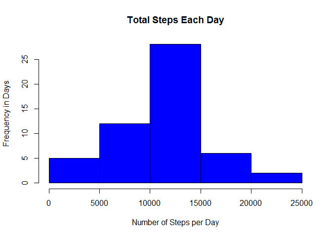
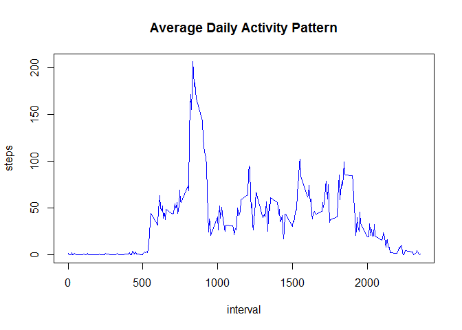

# Reproducible Research: Peer Assessment 1
### Loading and preprocessing the data


```r
library(ggplot2)
```

```
## Warning: package 'ggplot2' was built under R version 3.2.3
```

```r
library(dplyr)
```

```
## 
## Attaching package: 'dplyr'
## 
## The following objects are masked from 'package:stats':
## 
##     filter, lag
## 
## The following objects are masked from 'package:base':
## 
##     intersect, setdiff, setequal, union
```

```r
library(lattice)

library(knitr)
```

```
## Warning: package 'knitr' was built under R version 3.2.3
```

```r
setwd("C:/Shahrzad_Docs/PERSONAL_DOCUMENTS/COURSERA/RepData_PeerAssessment1-master/RepData_PeerAssessment1-master/activity")

activity <- read.csv("activity.csv", colClass=c('integer', 'Date', 'integer'))

head(activity)
```

```
##   steps       date interval
## 1    NA 2012-10-01        0
## 2    NA 2012-10-01        5
## 3    NA 2012-10-01       10
## 4    NA 2012-10-01       15
## 5    NA 2012-10-01       20
## 6    NA 2012-10-01       25
```

### What is mean total number of steps taken per day?


```r
sum_steps_groupby_day<- aggregate(steps ~ date, activity, sum)

head(sum_steps_groupby_day)
```

```
##         date steps
## 1 2012-10-02   126
## 2 2012-10-03 11352
## 3 2012-10-04 12116
## 4 2012-10-05 13294
## 5 2012-10-06 15420
## 6 2012-10-07 11015
```

```r
hist(sum_steps_groupby_day$steps, main = "Total Steps Each Day", col="blue", xlab="Number of Steps per Day",ylab="Frequency in Days")
```

 

```r
mean(sum_steps_groupby_day$steps)
```

```
## [1] 10766.19
```

```r
median(sum_steps_groupby_day$steps)
```

```
## [1] 10765
```

### What is the average daily activity pattern?


```r
avg_steps_groupby_interval <- aggregate(steps ~ interval, activity, mean)

plot(avg_steps_groupby_interval, type='l',col = "blue",main="Average Daily Activity Pattern")
```

 

```r
avg_steps_groupby_interval$interval[which.max(avg_steps_groupby_interval$steps)]
```

```
## [1] 835
```

### Imputing missing values


```r
sum(is.na(activity$steps))
```

```
## [1] 2304
```

```r
avg_steps_groupby_date <-aggregate(steps ~ date, activity, mean)

Imputed_activity <- merge(activity, avg_steps_groupby_date, by="date")

NAs <- is.na(Imputed_activity$steps.x)

Imputed_activity$steps.x[NAs] <- Imputed_activity$steps.y[NAs]

head(Imputed_activity)
```

```
##         date steps.x interval steps.y
## 1 2012-10-02       0     1740  0.4375
## 2 2012-10-02       0     1715  0.4375
## 3 2012-10-02       0     1725  0.4375
## 4 2012-10-02       0     1710  0.4375
## 5 2012-10-02       0     1735  0.4375
## 6 2012-10-02       0     1855  0.4375
```

```r
sum(is.na(Imputed_activity$steps.x))
```

```
## [1] 0
```

```r
Imputed_activity[,c("date","steps","interval")]<-Imputed_activity[,c(1,2,3)]

Imputed_activity<-Imputed_activity[,c(1,5,3)]

Imputed_sum_steps_groupby_day<- aggregate(steps ~ date, Imputed_activity, sum)

head(Imputed_sum_steps_groupby_day)
```

```
##         date steps
## 1 2012-10-02   126
## 2 2012-10-03 11352
## 3 2012-10-04 12116
## 4 2012-10-05 13294
## 5 2012-10-06 15420
## 6 2012-10-07 11015
```

```r
hist(Imputed_sum_steps_groupby_day$steps, main = "Total Steps Each Day", col="blue", xlab="Number of Steps per Day",ylab="Frequency in Days")
```

 

```r
mean(Imputed_sum_steps_groupby_day$steps)
```

```
## [1] 10766.19
```

```r
median(Imputed_sum_steps_groupby_day$steps)
```

```
## [1] 10765
```

No impact since we used the day average for the missing numbers.


### Are there differences in activity patterns between weekdays and weekends?


```r
Imputed_activity <- mutate(Imputed_activity, week_type = ifelse(weekdays(Imputed_activity$date) == "Saturday" | weekdays(Imputed_activity$date) == "Sunday", "weekend", "weekday"))

Imputed_activity$week_type <- as.factor(Imputed_activity$week_type)

head(Imputed_activity)
```

```
##         date steps interval week_type
## 1 2012-10-02     0     1740   weekday
## 2 2012-10-02     0     1715   weekday
## 3 2012-10-02     0     1725   weekday
## 4 2012-10-02     0     1710   weekday
## 5 2012-10-02     0     1735   weekday
## 6 2012-10-02     0     1855   weekday
```

```r
Imputed_avg_steps_groupby_interval <- aggregate(steps ~ interval + week_type, Imputed_activity, mean)

xyplot(steps ~ interval | week_type, data=Imputed_avg_steps_groupby_interval, layout=c(1,2), type='l')
```

 

The two graphs show that there are differences bewtween weekdays and weekends


